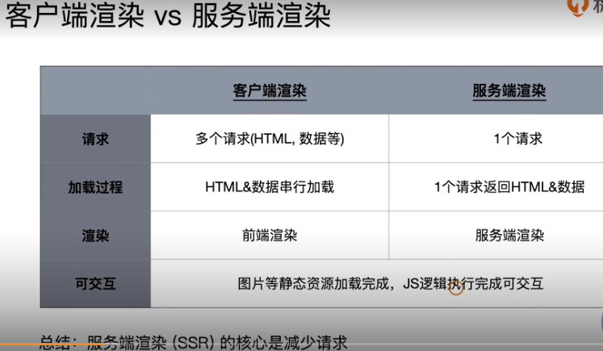

## 1. 自动清理构建目录产物

- 避免构建前每次都需要手动删除 dist,使用`clean-wepack-plugin`,这个插件默认会删除`output`指定的输出目录。
- 使用方法：

```js
// 第一步，安装 npm install --save-dev clean-webpack-plugin
// 第二步：引入const CleanWebpackPlugin = require('clean-webpack-plugin')
// 第三步：加到插件数组里面去。在plugin数组中加上new CleanWebpackPlugin()
```

## 2. PostCSS 插件 autoprefixer 自动补齐 CSS3 前缀

- 使用 autoprefixer 插件可以实现前缀的自动补齐。autoprefixer 插件是后处理器，也就是说在代码生成完了之后再给添加前缀。
- 通常还是会结合`postcss-loader`插件一起使用。

```js
// 在配置文件中，在module中的rule中加上
{
        test: /.less$/,
        use: [
          MiniCssExtractPlugin.loader,
          'css-loader',
          'less-loader',
          {
            loader: 'postcss-loader',
            options: {
              plugins: () => [
                require('autoprefixer')({
                  browsers: ['last 2 version', '>1%', 'ios 7']
                })
              ]
            }
          }
        ]
      },
```

## 3. 移动端 CSS px 自动转换成 rem

- 以前适配方法： 1. css 媒体查询实现响应式布局：缺陷：需要些多套适配样式代码;
- rem 是什么？

```
W3C对rem的定义：font-size of the root element

rem和px的对比：rem是相对单位；px是绝对单位。

```

- 使用`px2rem-loader`将 px 转换成 rem，页面渲染时计算根元素的`font-size`的值(可以使用手淘的`lib-flexible`库)。
- 使用方法：

```js
// 第一步：在配置文件中,加上这个loader
 {
  loader: 'px2rem-loader',
  options: {
    remUnit: 75,
    remPrecision: 8
  }
}
// 第二步：在index.html文件中引入`lib-flexible.js`的代码
```

## 4. 静态资源内联

- 资源内联的意义：

```
1. 代码层面：
 页面框架的初始化脚本
 上报相关打点
 css内联避免页面闪动

2. 请求层面：减少HTTP网络请求数
 小图片或者字体内联(url-loader)
```

- HTML 和 JS 内联： 用`raw-loader`,注意版本，最新版本有点问题
- CSS 内联：方案一：借助`style-loader`，方案二：`html-inline-css-webpack-plugin`使用内联的时候要使用 ejs 语法插入

## 5.多页面应用打包通用方案

- 多页面应用(MPA)概念：每一次页面跳转的时候，后台服务器都会给返回一个新的 html 文档，这种病类型的网站也就是多页网站，也叫作多页应用。每个页面是解耦的，seo 更友好。
- 思路：动态获取 entry 和设置`html-webpack-plugin`数量。利用 glob.sync 去引入入口。

```js
// 第一步：将所有的页面都放到相应的文件夹下面
// 第二步：安装glob库
// 第三步：在配置文件中修改配置

// 生成entry和htmlWebpackPlugins
const setMPA = () => {
  const entry = {}
  const htmlWebpackPlugins = []
  const entryFiles = glob.sync(path.join(__dirname, './src/*/index.js'))

  Object.keys(entryFiles).map(index => {
    const entryFile = entryFiles[index]

    const match = entryFile.match(/src\/(.*)\/index\.js/)
    const pageName = match && match[1]

    entry[pageName] = entryFile
    htmlWebpackPlugins.push(
      new HtmlWebpackPlugin({
        template: path.join(__dirname, `src/${pageName}/index.html`),
        filename: `${pageName}.html`,
        chunks: [pageName],
        inject: true,
        minify: {
          html5: true,
          collapseWhitespace: true,
          preserveLineBreaks: false,
          minifyCSS: true,
          minifyJS: true,
          removeComments: false
        }
      })
    )
  })
  return {
    entry,
    htmlWebpackPlugins
  }
}

module.exports = {
  entry: entry,
  plugins: [].concat(htmlWebpackPlugins)
}
```

## 6.使用 source map

- webpack 最终会打包成一个 bundle 文件(一个大的 js 文件)
- source map 科普文，[点这里](http://www.ruanyifeng.com/blog/2013/01/javascript_source_map.html)
- 开发环境开启，线上环境关闭
- source map 关键字：

```js
eval: 使用eval包裹的模块代码
source map: 产生.map文件
cheap: 不包含列信息
inline: 将.map作为DataURI嵌入，不单独生成.map文件
module: 包含loader的sourcemap
```

- source map 的调试运用：在配置文件中，通过 devtool 选项来控制

## 7. 提取页面公共资源

- 利用`SplitChunksPlugin`进行公共脚本分离。`SplitChunksPlugin`是 webpack4 内置的，替代`CommonsChunkPlugin`插件。
- chunks 参数说明：

```js
async异步引入的库进行分离（默认）
initial同步引入的库进行分离
all所有引入的库进行分离（推荐）
```

- 基础库分离：使用`html-webpack-externals-plugin`。具体使用如下：

```js
// 第一步：安装html-webpack-externals-plugin插件
// 第二步：在配置文件中
const HtmlWebpackExternalsPlugin = require('html-webpack-externals-plugin')

new HtmlWebpackExternalsPlugin({
  externals: [
    {
      module: 'react',
      entry: 'https://unpkg.com/react@16/umd/react.production.min.js',
      global: 'React'
    },
    {
      module: 'react-dom',
      entry: 'https://unpkg.com/react-dom@16/umd/react-dom.production.min.js',
      global: 'ReactDOM'
    }
  ]
})
```

- 利用`SplitChunksPlugin`分离基础包，用 test，具体做法是根据文档来配置
- 利用`SplitChunksPlugin`分离页面公共文件，`minChunks`设置最小引用次数为 2 次，`minuSize`分离的包体积的大小。具体做法是根据文档来配置。

## 8.tree shaking（摇树优化）

- 在 webpack4 已经默认支持了。在`.babelrc`里设置`module:false`即可。`mode: production`的情况下默认开启。
- `tree shaking`就是只把用到的方法打入 bundle，没用到的方法会在 uglify 阶段被擦除掉。
- **必须是 ES6 的语法，CJS 的方式不支持**。
- DCE(Elimination)指的是：

```
代码不会被执行，不可到达
代码执行的结果不会被用到
代码只会影响死变量（只写不读）

```

- Tree-shaking 原理：本质还是对代码进行静态的分析。把一些 DCE 的代码在 uglify 阶段删除掉。

## 9. Scope Hoisting 使用和原理分析

- webpack 的模块机制：

```
打包出来的是一个IIFE（匿名闭包）
modules是一个数组，每一项是一个模块初始化函数
__webapck_require用来加载模块，返回module.exports
通过WEBPACK_REQUIRE_METHOD(O)启动程序
```

- `scope hoisting`原理: 将所有模块的代码按照引用顺序放在一个函数作用域李，然后适当的重命名一些变量以防止变量名冲突。通过`scope hoisting`可以减少函数声明代码和内存开销。

## 10. 代码分割和动态 import

- 代码分割的意义，对于大的 web 应用来讲，将所有的代码都放在一个文件中显然是不够有效的，特别是当你的某些代码块是在某些特殊的时候才会被使用到。webpack 有一个功能就是讲你的代码库分割成 chunks（语块），当代码运行到需要他们的时候在进行加载。
- 代码分割适用的场景：抽离相同的代码到一个共享块；脚本懒加载，使得初始下载的代码更小。
- 懒加载 JS 脚本的方式：

```js
  CommonJS: require.ensure
  ES6: **动态** import（目前还没有原生支持，需要babel转换）
```

- 如何使用动态 import？

```js
1. 安装babel插件: npm install @babel/plugin-syntax-dynamic-import -D
2. ES6：动态import，在.babelrc文件中，插入如下代码
{
  "plugins": ["@babel/plugin-syntax-dynamic-import"],
  ...
}
```

## 11.在 webpack 中使用 ESLint

- 制定团队的 ESLint 规范遵循规则：

```js
1. 不重复造轮子，基于eslint:recommend配置并改进
2. 能够帮助发现代码错误的规则，全部开启
3. 帮助保持团队的代码风格统一，而不是限制开发体验
```

- ESLint 如何执行落地？1.和 CI/CD 系统集成；2.和 webpack 集成
- webpack 与 ESLint 集成，使用`eslint-loader`,构建时进行 JS 检查

## 12 webpack 打包组件和基础库

- 题目：实现一个大整数加法库的打包：需要打包压缩版和非压缩版；支持 AMD/CJS/ESM 模块引入
- 实现步骤：

```js
// 1. 先把组件库/基础库的源代码写好，如src/index.js
// 2. 编写配置文件webpack.config.js文件，注意terser-webpack-plugin插件，压缩代码
const TerserPlugin = require('terser-webpack-plugin')

module.exports = {
  entry: {
    'large-number': './src/index.js',
    'large-number.min': './src/index.js'
  },
  output: {
    filename: '[name].js',
    library: 'largeNumber',
    libraryTarget: 'umd',
    libraryExport: 'default'
  },
  mode: 'none',
  optimization: {
    minimize: true,
    minimizer: [
      new TerserPlugin({
        include: /\.min\.js$/
      })
    ]
  }
}
// 3. 在pakage.json中，main字段对应的index.js文件中的逻辑，判断在不同环境下使用不同的文件
// 4. 想要把库发布到npm上面，首先需要有npm的账号，登录上去npm publish就好了
// 5. 使用我们发布的组件库，需要安装npm install large-number -S,安装好后就在需要用到的地方引用进来，import largeNumber from 'large-number'
```

## 13. webpack 实现 SSR 打包

- SSR 是什么？

```js
渲染：HTML + CSS + JS + Data -> 渲染后的HTML

服务端：
  所有模板等资源都存储在服务端
  内网机器拉取数据更快
  一个HTML返回所有数据
```

- 
- 
- ssr 的优势：减少白屏的时间；对于 SEO 友好。
- SSR 代码实现思路：

```js
服务端：
  使用react-dom/server的renderToString方法将React组建渲染成字符串
  服务端路由返回对应的模板

客户端
  打包出针对服务端的组件
```

- webapck ssr 打包存在的问题

```js
浏览器的全局变量(Node.js中没有document, window)
  组件适配：将不兼容的组件根据打包环境进行适配
  请求适配：将fetch或者ajax发送请求的写法改成isomorphic-fetch或者axios

样式问题(Node.js无法解析css)
  方案一：服务端打包通过ignore-loader忽略掉CSS的解析
  方案二：将style-loader替换成isomorphic-style-loader
```

- 如何解决样式不显示的问题？使用打包出来的浏览器端 html 为模板，设置占位符，动态插入组件

```js
```

## 14. 优化构建时命令行的显示日志

- 使用统计信息(stats)
- 使用`friendly-errors-webpack-plugin`可定制一些显示的提示格式

## 15. 构建异常和中断处理

- 如何判断构建是否成功？在 CI/CD 的 pipline 或者发布系统需要知道当前构建状态；每次构建完成后输入`echo $?` 获取错误码
- webpack4 之前的版本构建失败不会抛出错误码；
- 如何主动获取并处理构建错误？compiler 在每次构建结束后会触发 done 这个 hook；process.exit 主动处理构建报错。

* 实战：

```js
new FriendlyErrorsWebpackPlugin(),
  function() {
    this.hooks.done.tap('done', stats => {
      if (stats.compilation.errors && stats.compilation.errors.length && process.argv.indexOf('--watch') == -1) {
        console.log('build error')
        process.exit(1)
      }
    })
  }
```
