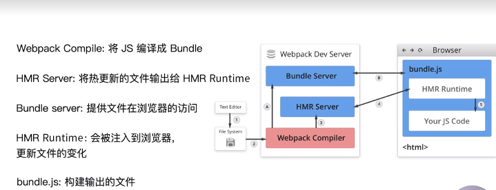

## 1. entry-用来指定打包入口

webpack 是模块化打包工具，webpack 的依赖图的入口是 entry。

- 单入口：entry 是一个字符串；
- 多入口：entry 是一个对象；每个入口文件写成 entry 的一个键值对；

## 2.output-用来指定打包的输出

- 单入口配置：只需要指定 filename 和 path 即可；
- 多入口配置：通过占位符确保文件名称的唯一，filename: '[name].js'

## 3.loaders：

- webpack 原生只支持 js 和 JSON 两种文件类型，通过 Loaders 去支持其他文件类型并且把他们转化成有效的模块，并且可以添加到依赖图中。
- loaders 本身是一个函数，接受源文件作为参数，返回转换的结果。

- 常见的 Loaders1 有哪些：

```
babel-loader - 转换ES6、ES7等JS新特性语法
css-loader - 支持.css文件的加载和解析
less-loader - 将less文件转化成css
ts-loader - 将TS转化成JS
file-loader - 进行图片、字体等的打包
raw-loader - 将文件以字符串的形式导入
thread-loader - 多进程打包JS和CSS
```

- 将需要用到的 Loaders 放到 modules 对象下面的 rules 数组中即可。对于每一个 rule，用 test 指定匹配规则，use 指定使用的 loader 名称。

## 4.plugins-增强 webpack 的功能

- 插件用于 bundle 文件的优化，资源管理和环境变量注入；作用于整个构建过程。插件目的在于解决 loader 无法实现的其他事。
- 用法：在 plugins 数组里面放进去定义好的插件即可。

## 5. mode

- Mode 用来指定当前的构建环境是：production、development 还是 none。默认是 production。这个概念是 webpack4 提出的概念，设置 mode 可以使用 webpack 内置的函数。

## 6. webpack 中如何解析 ES6

- babel-loader 是依赖于 babel 的。在.babelrc 文件中配置，

```js
{
  "presets": [
    "@babel/preset-env"
  ],
  "plugins": [
    "@babel/proposal-class-properties"
  ]
}
```

## 7. webpack 解析 css、less

- 安装`style-loader`,`css-loader`,`less-loader`;
- 在 webpack.config.js 配置文件中加上规则即可

## 8. webpack 解析图片和字体

- 图片和字体都不是 js 代码，解析他们都是需要用到`file-loader`;
- 在配置文件中加上规则；
- 也可以用`url-loader`来转换字体和图片，而且`url-loader`还能设置较小资源自动转换 base64

## 9.webpack 中的文件监听

- 文件监听是在发现源码发生变化时，自动重新构建出新的输出文件。
- webpack 开启监听模式，有两种方式:

```
启动webpack命令时，带上--watch参数

在配置webpack.config.js中设置watch:true。 watch默认是false
```

- watchOptions：一组用来定制 Watch 模式的选项

## 10. webpack 中的热更新及原理分析

- WDS(webpack-dev-server)不刷新浏览器，不输出文件，而是放在内存中。结合使用 HotModuleReplacementPlugin 插件。开启热更新功能
- webpack-dev-middleware(WDM)将 webpack 输出的文件传输给服务器，适用于灵活的定制场景。一般这种情况是需要引入 node 的 server，通常是 koa 或者 express
- 热更新原理：

```
Webpack Compile:将JS编译成Bundle
HMR Server：将热更新的文件输出给HMR Runtime
Bundle server：提供文件在浏览器的访问
HMR Runtime：会被注入到浏览器，更新文件的变化
bundle.js：构建输出的文件
```



- 热更新其实是有两个过程：启动阶段，在文件系统中编译打包，打包好后传给服务器。第二阶段：有文件发生了变化。

## 11. 文件指纹

- 什么是文件指纹？打包后输出的文件名的后缀，文件指纹可以作为版本管理。未修改的文件会使用缓存
- 文件指纹如何生成：

```
Hash: 和整个项目的构建相关，只要项目文件有修改，整个项目构建的hash值就会更改。
Chunkhash：和webpack打包的chunk有关，不同的entry会生成不同的chunkhash值。一般js是采用这种。在配置文件中，设置output的filename:'[name][chunkhash:8].js'
Contenthash：根据文件内容来定义hash，文件内容不变，则contenthash不变。一般css文件是采用这种。
```

- 如果用了`style-loader`和`css-loader`的话，其实会将 css 被插入到 style 里面，并且放在 head 头部。所以其实是没有一个单独的 css 文件，所以要用到 MiniCssExtractPlugin 插件把 css 提取出来成为独立文件。`style-loader`和 MiniCssExtractPlugin 插件功能是互斥的。

```js
// 在配置文件中
plugins: [
  new MiniCssExtractPlugin({
    filename: `[name][contenthash:8].css`
  });
]
```

- 图片的文件职位设置：

```js
// 设置file-loader的name，使用[hash]
// 在配置文件中
rules: [
  {
    test: /\.(png|svg|jpg|gif)$/,
    use: [
      {
        loader: 'file-loader',
        options: {
          name: 'img/[name][hash:8].[ext]'
        }
      }
    ]
  }
]
```

## 12. HTML、CSS 和 JavaScript 代码压缩

- JS 文件的压缩：webpack4 里面内置了`uglifyjs-webpack-plugin`。所以默认打包出来的文件 js 都压缩过。如果想要用这个插件中的一些选项，也可以安装他并使用。
- CSS 文件的压缩：使用`optimize-css-assets-webpack-plugin`同时使用`cssnano`预处理器来进行压缩：

```js
// 在webapck.config.js配置文件中
plugins: [
  new OptimizeCSSAssetsPlugin({
    assetNameRegExp: /\.css$/g,
    cssProcessor: require('cssnano)
  })
]
```

- HTML 文件的压缩：修改`html-webpack-plugin`,设置压缩参数：

```js
// 在配置文件中
plugins: [
  new HtmlWebpackPlugin({
    template: path.join(__dirname, 'src/search.html'),
    filename: 'search.html',
    chunks: ['search'],
    inject: true,
    minify: {
      html5: true
      ...
    }
  })
]
```
